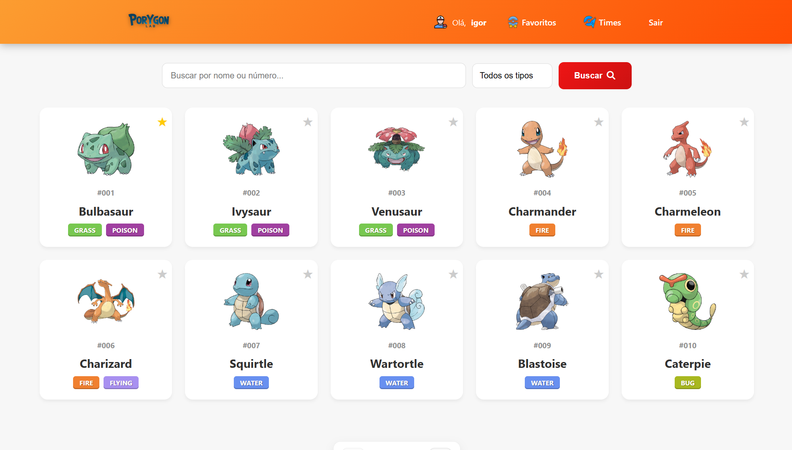
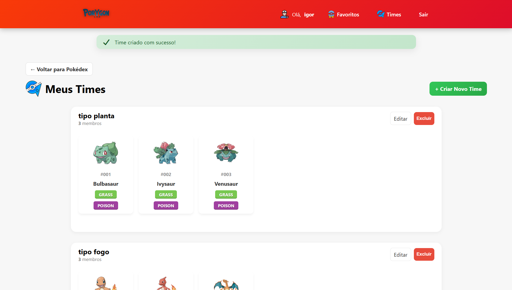
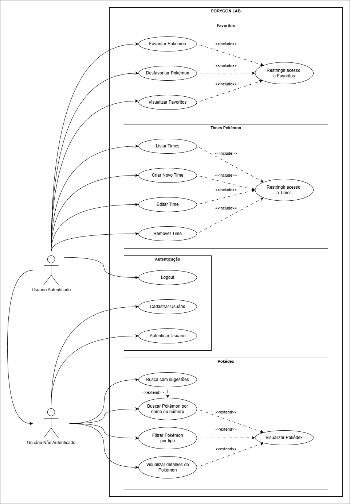
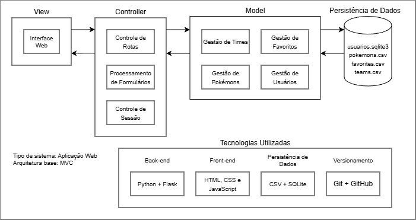

# PORYGON LAB

PORYGON LAB é uma aplicação web desenvolvida com **Flask (Python)** que simula uma **Pokédex interativa**, permitindo a visualização, busca, filtragem e gerenciamento de Pokémons, além de funcionalidades completas de **autenticação de usuários**, **favoritos** e **gerenciamento de times**.

O projeto foi desenvolvido como parte das disciplinas **Programação Web 1**, **Introdução à Programação** e **Introdução à Engenharia de Software**, seguindo boas práticas de desenvolvimento, versionamento com Git/GitHub e modelagem de requisitos.

---

## Visão Geral do Projeto

A aplicação oferece uma interface web responsiva, organizada e intuitiva, integrando frontend e backend de forma consistente.

### Página Principal – Pokédex

A Pokédex exibe os Pokémons carregados a partir de arquivos CSV, permitindo busca por nome ou número, filtragem por tipo e acesso aos detalhes de cada Pokémon.



## Autenticação de Usuário

O sistema permite **cadastro, login e logout de usuários**, com controle de sessão e **restrição de acesso** a funcionalidades específicas.


---

## Gerenciamento de Times

Usuários autenticados podem **criar, editar, listar e remover times de Pokémons**, respeitando o limite máximo de **seis Pokémons por time**.



---

## Funcionalidades Principais

### Pokédex
- Visualização de Pokémons a partir de arquivo CSV
- Busca por nome ou número
- Filtro por tipo
- Sugestões automáticas durante a digitação
- Página de detalhes do Pokémon

### Autenticação
- Cadastro de usuários
- Login e logout
- Controle de sessão
- Restrições de acesso a rotas protegidas

### Favoritos
- Favoritar e desfavoritar Pokémons
- Listagem de Pokémons favoritados por usuário
- Acesso restrito para usuários autenticados

### Times
- Criação de times com até 6 Pokémons
- Edição de times existentes
- Remoção de times
- Listagem de times por usuário
- Controle de acesso às rotas de times

---

## Modelagem de Requisitos

### Diagrama de Casos de Uso (UML)

O diagrama abaixo apresenta a **modelagem geral dos casos de uso do sistema**, organizados por blocos funcionais.



---

## Arquitetura do Sistema

O projeto segue uma **arquitetura em camadas**, separando responsabilidades entre apresentação, controle, lógica de negócio e persistência de dados.

### Visão Arquitetural



## Instalação e Execução

### Pré-requisitos
- Python 3.x
- Git

### Passos

```bash
git clone https://github.com/seu-usuario/porygon-lab.git
cd porygon-lab
python -m venv venv
venv\Scripts\activate
pip install -r requirements.txt
python app.py
```

A aplicação estará disponível em:

[http://localhost:5000](http://localhost:5000)